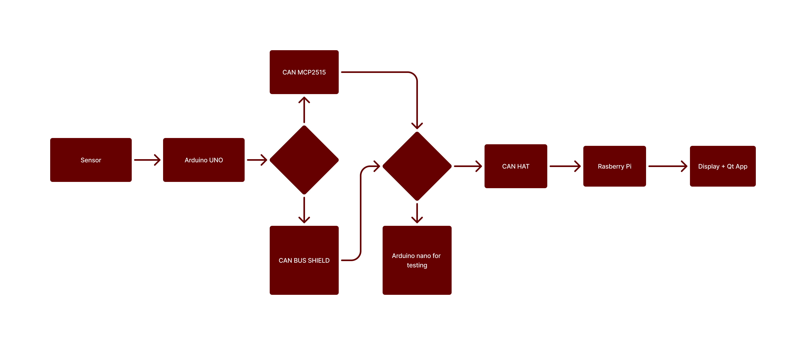

## **📍 [DES] Instrument Cluster - Team 2**
- Contributing to : https://github.com/SEA-ME/DES_Instrument-Cluster

## 📍 Members
|🐱|🐰|🐻‍❄️|🐶|
|:------:|:---:|:---:|:------:|
|[Jisoo](https://github.com/nimo-my)|[Alexander](https://github.com/atoepper)|[Welf](https://github.com/Welf42)|[Ahsan](https://github.com/Ahsanbaloch)|
|HW&Compiling|Qt&Preprocessing|Qt&Compiling|HW&scipting|

## 📍 FlowChart

## 📚 Documentations (Wiki)
01. [Arduino](https://github.com/SEA-ME-ForcePush/Instrument-Cluster/wiki/%5B1%5D-Arduino)
02. [CAN](https://github.com/SEA-ME-ForcePush/Instrument-Cluster/wiki/%5B2%5D-CAN)
03. [Qt](https://github.com/SEA-ME-ForcePush/Instrument-Cluster/wiki/%5B3%5D-Qt)
04. [Data preprocessing](https://github.com/SEA-ME-ForcePush/Instrument-Cluster/wiki/%5B4%5D-Data-preprocessing)
05. [Compilation](https://github.com/SEA-ME-ForcePush/Instrument-Cluster/wiki/%5B4%5D-Compilation)
06. [Testings and struggles](https://github.com/SEA-ME-ForcePush/Instrument-Cluster/wiki/%5B%E2%80%90%5D-Testings-and-Struggles)

