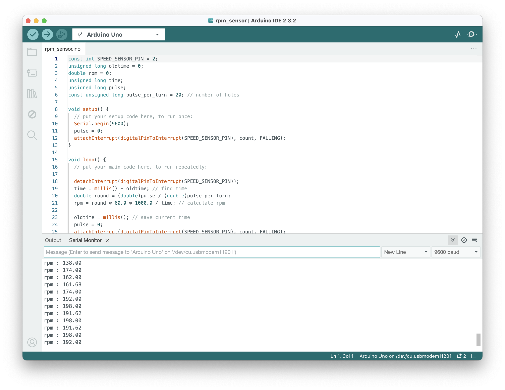

# Instrument Cluster
## 01. Arduino - calculating rpm by speed sensor 
- rpm_sensor
: rpm_sensor made by arduino codes

#### Starting...
1. Install arduino IDE
2. You can check rpm rate by clicking the serialMonitor (Tool > serialMonitor) below.

#### Result
(stat : motor running), but still needs to flatten the data using the filter. (bonus part)

## 02. Testing connection with arduinos (8 August 2024) 
(computer 1 (sender) - arduino uno(connected with the speed sensor) - CAN SHIELD 1 - CAN SHIELD 2 - arduino nano(using bread board) - computer 2 (reciever))
                                  
#### Basic Settings
- Download 'Arduino IDE'.
- Set the right board and the port that you're going to work on.

#### Code Settings
- Have to install 'CAN BUS SHIELD' library (Sketch > Include Library > Manage Libraries).
- todo

#### Stuggles
- todo
